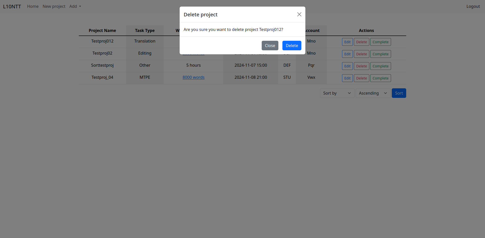
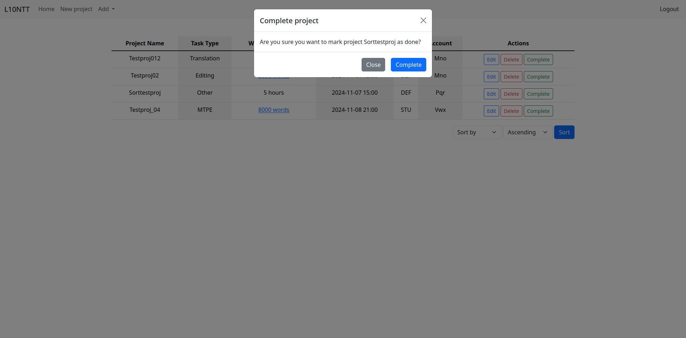
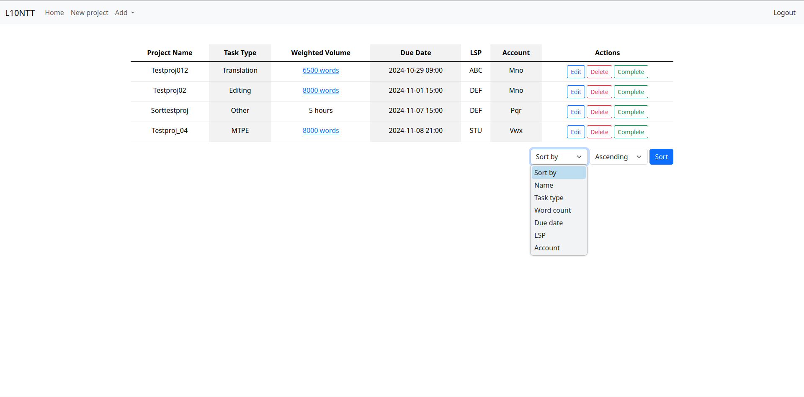
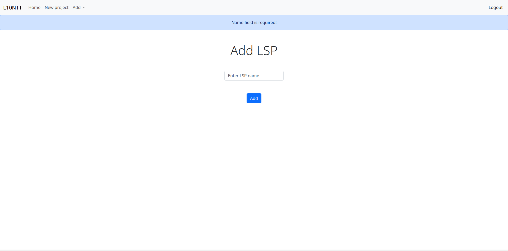

# Localization Task Tracker

**Video link:** https://youtu.be/mBWflz7Ur_4

## Introduction

Localization Task Tracker is a Flask app for freelance localization professionals to track their tasks. Users can add Language Service Providers (LSPs) they work with and accounts they work on, and create, edit, complete and delete projects.

## Features

### User Authentication

**Login**: Users can log in with a username and password. Passwords are securely hashed using werkzeug.security's `generate_password_hash` function.


**Registration**: New users can register for an account by providing a username and password. There is basic server-side validation.


**Logout**: Users can securely log out of the application.

### Project Managament

**Add Project**: Users can add new projects by specifying details such as LSP, account, task type (e.g., editing, translation), date, time, and word count. The app automatically calculates weighted words based on the task type.


**Edit Project**: Users can modify the details of existing projects.


**Delete Project**: Users can delete projects they no longer wish to track for any reason.



**Mark as Complete**: Projects can be marked as completed, which will remove them from the active project list.



### Sorting

**Sort Projects**: Projects can be sorted based on different criteria such as project name or weighted word count, to provide an organized view of ongoing tasks.



### Data Validation & Error Handling

**Input Validation**: Input validation ensures that no invalid data (e.g., negative word counts or missing fields) is entered.



**Flash Messages**: The app provides real-time feedback using flash messages for actions like logging in, adding projects, or encountering errors.


### Database Structure

This application uses an SQLite database (ltt.db) with the following tables:

**Users**: This table stores unique user IDs, usernames and hashed passwords.

**Projects**: This table stores project data, such as word count, due date, project name, etc.

**LSPs**: This table stores LSPs added by the user. Added items are linked to user, meaning only they can access them.

**Accounts**: This table stores accounts added by the user. Added items are linked to user, meaning only they can access them.

## Technologies Used

- [**Flask**](https://flask.palletsprojects.com/en/stable/)
- [**Bootstrap**](https://getbootstrap.com/)
- [**SQLite**](https://www.sqlite.org/index.html)

## Running the App

### Requirements

Python and SQLite must be installed to run the app.

### Steps

**1.** Clone the repository:

```
git clone https://github.com/goncu/locTaskTracker.git
cd locTaskTracker
```

**2.** Create a virtual environment:

```
python3 -m venv venv
```

**3.** Activate the virtual environment:

- On macOS/Linux:

```
source venv/bin/activate
```

- On Windows:

```
venv\Scripts\activate
```

**4.** Install required dependencies:

```
pip3 install -r requirements.txt
```

**5.** Set up the database:

```
sqlite3 ltt.db < schema.sql
```

**6.** Run the app:

```
flask run
```

You can access the app at http://127.0.0.1:5000/

## Future Improvements

- Add a rate feature to track earnings
- Detail task types
- Provide pie charts to present projects in a more visual and intuitive way
- Support for more analysis breakdowns (e.g., the ability to create different fuzzy match levels, distinguishing between different exact matches)
- Automate adding projects through script or extension
- And more...

## Acknowledgements

Some functions, such as `login`, `register`, and `login_required`, were adapted from the CS50 Finance problem set.

This project was developed as part of the [CS50x](https://cs50.harvard.edu/x/2024/) final project. Special thanks to the **CS50 team** for their exceptional course and support!
